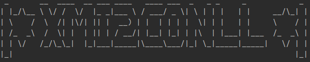

# xmi2conll CLI

<!-- add badge python version, pypi etc. -->



Simple CLI to convert any annotated document in UIMA CAS XMI to CONLL format.

## Installation:

- normal (use pip):

```bash
pip install xmi2conll
```

- dev:


## Usage:

```bash
python x2c.py --help
```

```bash
Usage: x2c.py [OPTIONS] INPUT_XMI TYPESYSTEM

  XMI to CONLL Converter CLI © 2022 - @Lucaterre

  INPUT_XMI (str): XMI file path or directory path that contains XMI for batch
  processing.

  TYPESYSTEM (str): Typesystem.xml path.

Options:
  -o, --output TEXT               output path that contains new conll.
                                  [default: ./output/]
  -tn, --type_name_annotations TEXT
                                  type name of the annotations  [default: de.t
                                  udarmstadt.ukp.dkpro.core.api.ner.type.Named
                                  Entity]
  -s, --conll_separator TEXT      Defines a separator in CONLL between mention
                                  and label eg. ' ' (space sep) or '\t' (tab
                                  sep)  [default:  ]
  -h, --header BOOLEAN            show or hide title of CLI  [default: True]
  --help                          Show this message and exit.
```

## Citation:

## Licence:
